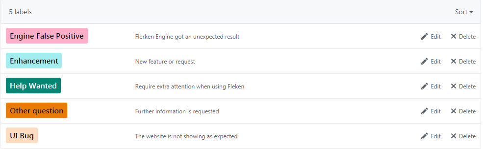

  

<h1 align="center">Flerken</h1>

  
  
  
  

## Introduction

<b>Command line obfuscation</b> has been proved to be a non-negligible factor in fileless malware or malicious actors that are "living off the land". To bypass signature-based detection, dedicated obfuscation techniques are shown to be used by red-team penetrations and even APT activities. Meanwhile, numerous obfuscators (namely tools perform syntax transformation) are open sourced, thus making obfuscating given commands increasingly effortless.

<b>However, the number of suitable defenses remains to be few.</b> For Linux command line obfuscation,we can barely find any detection tools. Concerning defenses against Windows command obfuscation, existing schemes turn out to either lack of toolization, or only partially resolve the entire problem, sometimes even inaccurately.

To better facilitate obfuscation detection, <b>we have proposed Flerken, a toolized platform that can be used to detect both Windows (CMD and Powershell) and Linux (Bash) commands</b>. The name of Flerken is inspired by a cat-like yet extremely powerful creature from Marvel world. Flerken is build on the basis of carefully collection of black/white samples, and can be divided into two sub-schemes, namely Kindle (Windows obfuscation detector) and Octopus (Linux obfuscation detector). To help optimize Flerken's classification performance, we adopt techniques such as machine learning, bi-directional feature filter ring, script sandboxing.

## Documentation

For a detailed description of Flerken, please review our specification document <a href="https://github.com/We5ter/Flerken/blob/master/doc/Flerken_v1.0%20_Specification_%20Document.pdf" target="_blank">here</a>.

## Quick start

- <b>Installation</b>
  
  #### Step 1: Ensure you have installed python 3.x on your server, you can use the following command to check it.
  
  `[root@server:~$] python -V`
  
  #### Step 2: Install the required components, all the prerequisite components have been declared in requirement.txt.
  
  `[root@server:~$] pip install -r requirement.txt`
  
  #### Step3: Custom your Flerken APP config as you want.
  `Path: flerken/config/global_config.py`
  
  #### Step4: Now you can run it!
   `[root@server:~$] python runApp.py`
   
  #### Step 5(Optional): You can build your own whitelists for reducing false positive rate.
  `Path: flerken/config/whitelists/`

 
- <b>How to use</b> 

  #### It's very easy to use as shown in the following picture, and we will also release API interfaces as soon.

  

## Getting Help

If you have any question or feedbacks on Flerken. Please create an issue and choose a suitable label for it. We will solve it as soon as possible.

  

## CHANGELOG

Please see our <a href="./CHANGELOG.md">CHANGELOG.md</a>

## Build-in 3rd parties

- <b>[Flask](http://flask.pocoo.org)</b>
- <b>[Flask-WTF](https://flask-wtf.readthedocs.io/en/stable)</b>
- <b>[Flask-Limiter](https://flask-limiter.readthedocs.io)</b>
- <b>[frankie-huang/pythonMySQL](https://github.com/frankie-huang/pythonMySQL)</b>
- <b>[jQuery](https://jquery.org)</b>
- <b>[Swiper](https://idangero.us/swiper)</b>

## Authors

- <a href="https://www.researchgate.net/profile/Yao_Zhang80" target="_blank">Yao Zhang</a>
- <a href="https://lightrains.org" target="_blank">Zhiyang Zeng</a>

## Acknowledgments

We would like to thank <b>Bghost Zhu, Junbo Li, Haizhang Du, Conan Hu, and other colleagues of Data
Security Team</b> for their insightful feedbacks throughout the project. We also thank <b>Ning Liu, Junjun
Luo, and Lake Hu</b> for their valuable comments and support.

## License

Flerken is released under the Apache 2.0 license.
